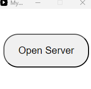
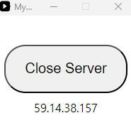
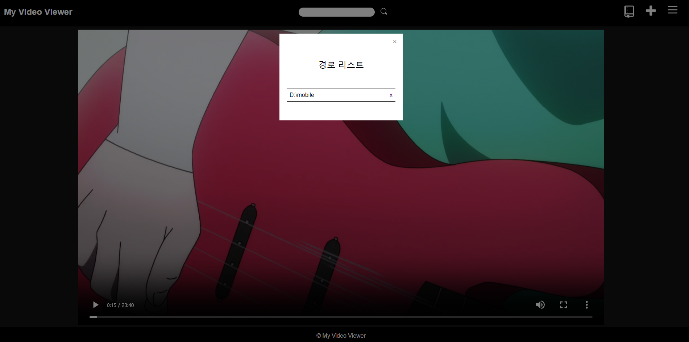

# -Web-MyVideoViewer
데스크탑으로 로컬호스트 포트를 열어서 동일한 네트워크 내에서 영상을 랜덤 재생하는 프로그램

## 사용 방법
### **1. 파일 열기**

myvideoviewer.exe 파일을 실행하면 위와 같은 프로그램이 실행됩니다.

### **2. 포트 열기**

'Open Server'를 선택하면 버튼이 'Close Server'로 바뀌고 그 아래에 현재 컴퓨터의 ipv4가 표시됩니다. 웹 페이지에서 '해당 포트:3000'으로 접속하면 됩니다. 예를 들어 ipv4가 '111.111.111.111'이라면 '111.111.111.111:3000'으로 접속해주세요.

### **3. 경로 추가하기**

해당 버튼은 경로를 추가하는 버튼입니다. 경로를 추가하기 위해서 클릭합니다.

### **4. 경로 입력하기**

영상들이 포함된 절대 경로를 입력합니다. 절대 경로가 뭔지 모른다면 탐색기로 영상들이 포함된 폴더로 들어가서 그대로 복사하고 붙여넣습니다.

### **5. 경로 확인하기**

경로가 성공적으로 추가되었는지 확인합니다. x를 누르면 해당 경로는 삭제가 가능합니다.

## 기능 및 설명

* 검색 기능은 디자인만 구현되어 있는 상태입니다. 단순히 파일 목록을 JavaScript로 가져오는 형식이고, 프로그램 내에서 DB를 사용하지 않아서 구현하지 않았습니다.

* 오른쪽 상단 메뉴를 클릭하면 현재 선택된 영상을 볼 수 있습니다.

* 컴퓨터로는 ↑, ↓을 선택시 틱톡처럼 영상을 랜덤으로 볼 수 있고, 모바일로는 터치를 통해 Swipe가 가능합니다. 

* 세션처리가 되어 있지 않기 때문에 같은 컴퓨터에서 동시에 접속하면 오류가 발생할 수 있습니다. 기본적으로 한 사람이 쓴다는 가정하에 프로그램을 작성했습니다.

* 모바일로 영상을 볼 때에는 모바일에서 지원 가능한 영상만 재생 가능합니다. H264 형식의 mp4 형식이 적합합니다. mkv 같은 파일 형식은 지원하지 않습니다.

## 여담

추가적인 요청사항이 있으면 남겨주세요.